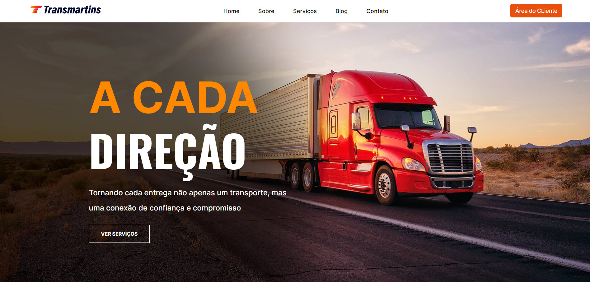

<h1 align="center">
  💻 Transmartins -  Pablo Santos
</h1>

<h4 align="center"><a href="https://pablo-m-santos.github.io/Transmartins/">Clique para visitar o site</a></h4>

## 🌳 Projeto
A Transmartins é uma empresa conta com uma frota moderna e diversificada, além de ser uma agência profissional de logística e cargas, visando sempre oferecer qualidade e segurança nos serviços prestados.

## 📃 Seções
A Transmartins é composto por 5 seções diferentes:

  -  Seção Home: ** Nela temos uma breve apresentação da empresa;
  -  Seção Sobre: ** Nessa seção tem uma breve descrição e sobre a empresa;
  -  Seção Serviços: ** Apresenta todos os serviços da empresa e meios de tranporte;
  -  Seção Blog: ** Nessa seção temos notícias e eventos relacionados a empresa ;
  -  Seção Contato: ** apresenta formas de como o cliente pode entrar em conato conosco e informações de contato;

## 👨🏽‍💻 Tecnologias utilizadas
Para o desenvolvimento da Transmartins usarei as seguintes tecnologias:
  - Visual Studio Code;
  - HTML ;
  - Css;
  - JavaScript ;
